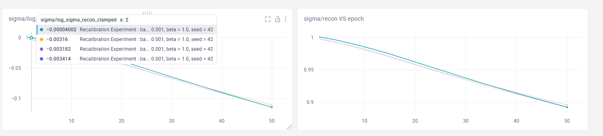

# Project Progress Log

## Problem Statement

The CFLIB (Indo-US) stellar spectral library has calibration inconsistencies.
MILES is treated as ground truth. CFLIB spectra have been resampled onto the
MILES wavelength grid.

**Methodology:** Train a VAE on MILES spectra to learn a clean latent
representation, then transfer/map CFLIB spectra into that latent space to
recalibrate them against the MILES reference.

---

## 2026-07-17 14:37

**Done:**
- Trained VAE on MILES spectra for 50 epochs (batch_size=200, lr=0.003)

**Next:**
- Review reconstruction quality
- Proceed to CFLIB latent transfer step

**Metrics:**

| Key | Value |
|-----|-------|
| batch_size | 200 |
| lr | 0.00300 |
| beta | 1.00000 |
| seed | 42 |
| epochs_trained | 50 |
| final_train_loss | 0.18158 |
| final_train_recon | 0.10846 |
| final_train_kl | 0.07313 |
| final_val_loss | 0.18256 |
| final_val_recon | 0.11070 |
| final_val_kl | 0.07186 |

## 2026-07-17 17:21

**Done:**
- Trained VAE on MILES spectra for 50 epochs (batch_size=200, lr=0.003)

**Next:**
- Review reconstruction quality
- Proceed to CFLIB latent transfer step

**Metrics:**

| Key | Value |
|-----|-------|
| batch_size | 200 |
| lr | 0.00300 |
| beta | 1.00000 |
| seed | 42 |
| epochs_trained | 50 |
| final_train_loss | 0.18158 |
| final_train_recon | 0.10846 |
| final_train_kl | 0.07313 |
| final_val_loss | 0.18256 |
| final_val_recon | 0.11070 |
| final_val_kl | 0.07186 |

## 2026-07-17 17:37

**Done:**
- Running Learning rate sweep for learning rate = 0.01, Trained VAE on MILES spectra for 50 epochs (batch_size=200, lr=0.003)

**Next:**
- Review reconstruction quality
- Proceed to CFLIB latent transfer step

**Metrics:**

| Key | Value |
|-----|-------|
| batch_size | 200 |
| lr | 0.01000 |
| beta | 1.00000 |
| seed | 42 |
| epochs_trained | 50 |
| final_train_loss | nan |
| final_train_recon | nan |
| final_train_kl | nan |
| final_val_loss | nan |
| final_val_recon | nan |
| final_val_kl | nan |

## 2026-07-17 17:37

**Done:**
- Running Learning rate sweep for learning rate = 0.001, Trained VAE on MILES spectra for 50 epochs (batch_size=200, lr=0.003)

**Next:**
- Review reconstruction quality
- Proceed to CFLIB latent transfer step

**Metrics:**

| Key | Value |
|-----|-------|
| batch_size | 200 |
| lr | 0.00100 |
| beta | 1.00000 |
| seed | 42 |
| epochs_trained | 50 |
| final_train_loss | 0.00042 |
| final_train_recon | 0.00041 |
| final_train_kl | 0.00001 |
| final_val_loss | 0.00857 |
| final_val_recon | 0.00856 |
| final_val_kl | 0.00001 |

## 2026-07-17 17:38

**Done:**
- Running Learning rate sweep for learning rate = 0.003, Trained VAE on MILES spectra for 50 epochs (batch_size=200, lr=0.003)

**Next:**
- Review reconstruction quality
- Proceed to CFLIB latent transfer step

**Metrics:**

| Key | Value |
|-----|-------|
| batch_size | 200 |
| lr | 0.00300 |
| beta | 1.00000 |
| seed | 42 |
| epochs_trained | 50 |
| final_train_loss | -0.11018 |
| final_train_recon | -0.11019 |
| final_train_kl | 0.00000 |
| final_val_loss | -0.09997 |
| final_val_recon | -0.09998 |
| final_val_kl | 0.00000 |

## 2026-07-17 17:38

**Done:**
- Running Learning rate sweep for learning rate = 0.0003, Trained VAE on MILES spectra for 50 epochs (batch_size=200, lr=0.003)

**Next:**
- Review reconstruction quality
- Proceed to CFLIB latent transfer step

**Metrics:**

| Key | Value |
|-----|-------|
| batch_size | 200 |
| lr | 0.00030 |
| beta | 1.00000 |
| seed | 42 |
| epochs_trained | 50 |
| final_train_loss | 0.03642 |
| final_train_recon | 0.03620 |
| final_train_kl | 0.00021 |
| final_val_loss | 0.07077 |
| final_val_recon | 0.07059 |
| final_val_kl | 0.00018 |

## 2026-07-31 16:01

**Done:**
- Running Learning rate sweep for learning rate = 0.001, Trained VAE on MILES spectra for 50 epochs (batch_size=200, lr=0.003) with sigma of reconstruction monitoring on

**Next:**
- Batch size sweep

**Metrics:**

| Key | Value |
|-----|-------|
| batch_size | 200 |
| lr | 0.00100 |
| beta | 1.00000 |
| seed | 42 |
| epochs_trained | 50 |
| final_train_loss | 0.01184 |
| final_train_recon | 0.01184 |
| final_train_kl | 0.00001 |
| final_val_loss | 0.01489 |
| final_val_recon | 0.01488 |
| final_val_kl | 0.00001 |

## 2026-07-31 16:01

**Done:**
- Running Learning rate sweep for learning rate = 0.003, Trained VAE on MILES spectra for 50 epochs (batch_size=200, lr=0.003) with sigma of reconstruction monitoring on

**Next:**
- Batch size sweep

**Metrics:**

| Key | Value |
|-----|-------|
| batch_size | 200 |
| lr | 0.00300 |
| beta | 1.00000 |
| seed | 42 |
| epochs_trained | 50 |
| final_train_loss | nan |
| final_train_recon | nan |
| final_train_kl | nan |
| final_val_loss | nan |
| final_val_recon | nan |
| final_val_kl | nan |

## 2026-07-31 16:01

**Done:**
- Running Learning rate sweep for learning rate = 0.0003, Trained VAE on MILES spectra for 50 epochs (batch_size=200, lr=0.003) with sigma of reconstruction monitoring on

**Next:**
- Batch size sweep

**Metrics:**

| Key | Value |
|-----|-------|
| batch_size | 200 |
| lr | 0.00030 |
| beta | 1.00000 |
| seed | 42 |
| epochs_trained | 50 |
| final_train_loss | 0.06435 |
| final_train_recon | 0.06428 |
| final_train_kl | 0.00007 |
| final_val_loss | 0.07175 |
| final_val_recon | 0.07169 |
| final_val_kl | 0.00006 |

**Best Learning rate in the experiment : 0.001**:
- Best KL and reconstruction uncertainty collapse
- Better convergence value of reconstruction loss

## 2026-07-31 17:07

**Done:**
- Running batch size sweep for batch size = 50

**Next:**
- latent dimension sweep

**Metrics:**

| Key | Value |
|-----|-------|
| batch_size | 50 |
| lr | 0.00100 |
| beta | 1.00000 |
| seed | 42 |
| epochs_trained | 50 |
| final_train_loss | 0.01184 |
| final_train_recon | 0.01184 |
| final_train_kl | 0.00001 |
| final_val_loss | 0.01489 |
| final_val_recon | 0.01488 |
| final_val_kl | 0.00001 |

## 2026-07-31 17:07

**Done:**
- Running batch size sweep for batch size = 100

**Next:**
- latent dimension sweep

**Metrics:**

| Key | Value |
|-----|-------|
| batch_size | 100 |
| lr | 0.00100 |
| beta | 1.00000 |
| seed | 42 |
| epochs_trained | 50 |
| final_train_loss | 0.00042 |
| final_train_recon | 0.00041 |
| final_train_kl | 0.00001 |
| final_val_loss | 0.00857 |
| final_val_recon | 0.00856 |
| final_val_kl | 0.00001 |

## 2026-07-31 17:08

**Done:**
- Running batch size sweep for batch size = 200

**Next:**
- latent dimension sweep

**Metrics:**

| Key | Value |
|-----|-------|
| batch_size | 200 |
| lr | 0.00100 |
| beta | 1.00000 |
| seed | 42 |
| epochs_trained | 50 |
| final_train_loss | 0.00424 |
| final_train_recon | 0.00423 |
| final_train_kl | 0.00000 |
| final_val_loss | 0.01241 |
| final_val_recon | 0.01240 |
| final_val_kl | 0.00000 |

## 2026-07-31 17:08

**Done:**
- Running batch size sweep for batch size = 250

**Next:**
- latent dimension sweep

**Metrics:**

| Key | Value |
|-----|-------|
| batch_size | 250 |
| lr | 0.00100 |
| beta | 1.00000 |
| seed | 42 |
| epochs_trained | 50 |
| final_train_loss | -0.02872 |
| final_train_recon | -0.02872 |
| final_train_kl | 0.00000 |
| final_val_loss | 0.01215 |
| final_val_recon | 0.01215 |
| final_val_kl | 0.00000 |

**Batch size of 100 performs the best in all. Reason maybe, larger batch size take more number of epochs to converge since variance per batch is more ? However batch size of 50 which is the smallest performs worse than that of 100**

**Upnext latent dimension sweep**

## 2026-08-15 15:28

**Done:**
- Running latent dimension sweep, current chosen latent dimension is 32

**Next:**
- MILES Transfer

**Metrics:**

| Key | Value |
|-----|-------|
| batch_size | 100 |
| lr | 0.00100 |
| beta | 1.00000 |
| seed | 42 |
| epochs_trained | 50 |
| final_train_loss | -0.02420 |
| final_train_recon | -0.02422 |
| final_train_kl | 0.00002 |
| final_val_loss | 0.00911 |
| final_val_recon | 0.00909 |
| final_val_kl | 0.00002 |

## 2026-08-15 15:28

**Done:**
- Running latent dimension sweep, current chosen latent dimension is 64

**Next:**
- MILES Transfer

**Metrics:**

| Key | Value |
|-----|-------|
| batch_size | 100 |
| lr | 0.00100 |
| beta | 1.00000 |
| seed | 42 |
| epochs_trained | 50 |
| final_train_loss | 0.00950 |
| final_train_recon | 0.00948 |
| final_train_kl | 0.00001 |
| final_val_loss | 0.00826 |
| final_val_recon | 0.00825 |
| final_val_kl | 0.00002 |

## 2026-08-15 15:28

**Done:**
- Running latent dimension sweep, current chosen latent dimension is 128

**Next:**
- MILES Transfer

**Metrics:**

| Key | Value |
|-----|-------|
| batch_size | 100 |
| lr | 0.00100 |
| beta | 1.00000 |
| seed | 42 |
| epochs_trained | 50 |
| final_train_loss | -0.02588 |
| final_train_recon | -0.02588 |
| final_train_kl | 0.00000 |
| final_val_loss | 0.00883 |
| final_val_recon | 0.00882 |
| final_val_kl | 0.00000 |

## 2026-08-15 15:28

**Done:**
- Running latent dimension sweep, current chosen latent dimension is 200

**Next:**
- MILES Transfer

**Metrics:**

| Key | Value |
|-----|-------|
| batch_size | 100 |
| lr | 0.00100 |
| beta | 1.00000 |
| seed | 42 |
| epochs_trained | 50 |
| final_train_loss | -0.02420 |
| final_train_recon | -0.02421 |
| final_train_kl | 0.00000 |
| final_val_loss | 0.00960 |
| final_val_recon | 0.00959 |
| final_val_kl | 0.00000 |

**Done**
- All choices of latent dimensions perform better, however the latent dimension of 128 performs a slightly better as the uncertainty converges the most in that choice.
- The difference is not very significant between the loss curves of each latent dimension choices. We will stick to 128.

